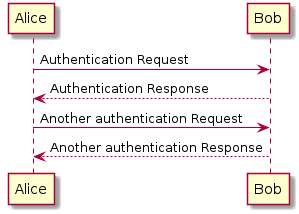
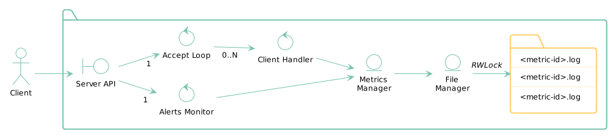

# Metrics && Alert Server -- [FdelMazo/7574-Distribuidos](https://github.com/FdelMazo/7574-Distribuidos)

## Introducción

El _Metrics && Alert Server_ es un sistema distribuido que almacena las
métricas de distintas aplicaciones. Provee tres funciones: 

- `LOG`: Almacenar una métrica nueva
- `QUERY`: Hacer una consulta manual donde se agregan las métricas almacenadas
- `NEW-ALERT`: Configurar una alarma nueva del sistema, para que el sistema nos
  notifique si algo está comportándose de forma anómala.

El sistema se constituye del servidor que almacena las métricas, y de uno o más clientes de
prueba que constantemente insertarán métricas en el sistema. Adicionalmente se pueden hacer consultas manuales desde cualquiera de los clientes.

```zsh
make up # Levanta el servidor y un cliente en un contenedor de Docker
make up CLIENT_REPLICAS=5 # Levanta el servidor y 5 clientes en un contenedor de Docker
make logs # Muestra todo lo que están logeando los contenedores
make manual # Hace attach del primer cliente del sistema, el cual nos permitirá hacer consultas de manera interactiva por entrada estándar
make down # Frena todos los containers
```

## Servidor -- `Server()` y `MetricsManager()`

El servidor del sistema consiste de el monitor de alertas, que corre en su propio
proceso, y del servidor en sí que esta constantemente a la escucha de nuevas conexiones
de clientes.

Es ahí que nos encontramos el primer problema de concurrencia: ¿Cómo hacemos
para atender varios clientes a la vez, sin ser vulnerables a un ataque de denegación de
servicio?

Para solucionar esto, el servidor tiene una `Pool` de procesos en la cual ejecutaremos
las conexiones que efectivamente querramos atender (a diferencia de las conexiones a las
que les devolveremos que el servidor está con alta carga y que no puede atender en este
momento). Pero, para evitar que este llamado sea bloqueante y podamos seguir escuchando
clientes y atender siguientes pedidos, la ejecución dentro del `Pool` se lo delegamos a
un proceso aparte del que escucha clientes.

```python
def run(): # En un poco de pyseudocódigo...
    while running:
        client_sock = self.accept() # Recibo un cliente nuevo

        # Confirmamos la carga del servidor preguntando la longitud de la carga de la pool
        if len(pool.carga) > N: 
            reply("We're busy, try again later")
            continue

        # pool.apply_async no ejecuta hasta que no llamemos a response.get()
        response = pool.apply_async(atender_cliente()) 
        process = multiprocessing.Process(response.get()).start()
```

Al atender a un nuevo cliente, tenemos que aplicar el comando que nos hayan enviado. En
el caso de los comandos de inserción de métrica y de agregación, llamamos a funciones de
`MetricsManager`: una capa arriba de nuestra base de datos (archivos `.log`) que tiene
funciones de agregación y guardado.

Como podemos ver tenemos un proceso nuevo por cada cliente aceptado el cual va a 
acompañar al pedido hasta el final del procesamiento, así asegurandose que el comando 
solicitado sea cumplido. Esto es distinto a tener un proceso o *pool* de procesos por 
cada comando en sí, donde podríamos lograr escalar el sistema de manera que si un 
comando en particular fuese nuestro cuello de botella y requisiese más recursos o poder
de cómputo que el resto, simplemente aumentaríamos el tamaño de esa *pool* en 
particular.



## Persistencia -- `FileManager()` y `RWLock()`

Cada métrica se almacena en su propio archivo de log. Una optimización a considerar
sería particionar aún más esta base de datos, y hacer un archivo por minuto de métrica
(o por día, o por semana, o adaptarnos al uso que le demos!). Como cada pedido de 
cliente sucede en un proceso separado, tenemos que evitar las *race conditions* que 
puedan surgir al querer acceder al archivo de la misma métrica, sea para lecturas o para
escrituras.

Si bien esto se puede lograr con un simple lock que evite que dos procesos accedan al
mismo archivo a la vez, una optimización que se puede agregar es la de preguntarnos qué
operación vamos a hacer sobre el archivo y en base a eso ver si permitimos múltiples
accesos o solo individuales. Esta optimización es un `Readers-Writer Lock`, un mecanismo
por encima de un lock en donde permitamos hacer varias operaciones de lectura (la
funcionalidad de agregación) en simultáneo, pero solo una operación de escritura (la
funcionalidad de almacenar métricas). La mayor parte del código y de la idea sale del
libro [Python
Cookbook](https://www.oreilly.com/library/view/python-cookbook/0596001673/ch06s04.html),
de la editorial O'Reilly.

Entonces, ahora que ya tenemos una manera de atender el acceso a cada archivo de métrica
por separado, solo nos queda buscar una manera de crear dinámicamente cada `RWLock`,
ya que al comienzo del programa no sabemos cuántas ni cuáles métricas vamos a atender en
la sesión. Para esto se mantiene un diccionario donde tenemos los pares `<clave:valor>` de
cada `<nombre de archivo:lock de archivo>` al cual atómicamente agregamos cada métrica que
aparezca en la ejecución.  Por supuesto que el acceso a este diccionario también debe
ser atómico, para evitar crear dos locks idénticos en simultáneo. 

El problema que surge al intentar hacer un lock común sobre este diccionario de locks es
que, como tenemos cada cliente en su propio proceso compartiendo referencias al objeto
global de `FileManager`, este lock normal no podría ser compartido entre procesos. Es 
por esto que usamos un `Manager().Lock()`: un candado especial de Python provisto por un
[Manager](https://docs.python.org/2/library/multiprocessing.html#managers) (una entidad
controlada por un *server process*) que puede ser compartido entre procesos.

Lo bueno de este tipo de candados es que, a diferencia de un candado normal que vive
solo dentro una computadora, nos dan una idea de como usar técnicas de programación
concurrentes en un entorno de *multicomputing*, ya que el `Manager()` de Python puede
correr en un servidor remoto (en otra computadora).

Por último, si bien el acceso a los archivos es controlado, no nos lastimaría que sea lo
más performante posible (y así tener el lock de acceso la menor cantidad de tiempo que 
se pueda). Es por esto que, ya que nuestros archivos serán de *logging*, el cual es un 
entorno donde los eventos mas recientes suelen ser los que más nos interesan, una
optimización que se hace sobre la lectura del archivo es que siempre leemos los archivos
de atrás para adelante, agarrando las últimas líneas, en vez de intentar guardarlo todo
en memoria.

Una restricción que nos agrega esta idea de leer el archivo comenzando desde el final es
que si el comando recibido implica agregar una cantidad descolosal de métricas nos vemos
forzados a tener todas estas métricas en memoria en el mismo instante, algo que no 
siempre es realizable. Si nosotros quisiesemos evitar eso, deberíamos iterar el archivo
desde el comienzo e ir procesando las métricas en baches del tamaño de la ventana de
agregación, así manteniendo en memoria solamente una fracción de todas las métricas
solicitadas a la vez. De todas formas, esta solución haría que mantengamos el lock sobre
el archivo por más tiempo, ya que mientras estamos haciendo el procesamiento seguiríamos
con el archivo abierto (o alternativamente, abriríamos más veces el archivo por cada
comando, lo cual en esencia nos lleva al mismo problema), haciendo que otros procesos 
estén bloqueados de esa métrica por mayor cantidad de tiempo. Es por este trade-off 
(tener todas las métricas en memoria pero tener una lectura performante *vs* evitar que
otros procesos accedan al archivo por más tiempo y que la lectura no este optimizada) 
que se mantiene la idea de iterar el archivo de atrás para adelante.



## Alertas -- `AlertMonitor()` 

Por último, nos queda el monitor [^1] de alertas. Este servicio de alertas consiste de
un *loop* periódico que, en su propio proceso,  cada un minuto se fija si alguna de
todas las alertas configuradas con el comando `NEW-ALERT` debe ser señalizada. Para esto
hace un llamado (interno, obviamente) al método de agregación de la alerta configurada.
Es decir, `NEW-ALERT mi-metrica MIN 1 5` llama a un comando casi idéntico al que
llamaría `QUERY mi-metrica MIN 1`, y se fija si el resultado supera el límite de `5`. La
única diferencia es que este llamado incluye que el agregado sea solamente sobre las 
métricas recibidas en el último minuto (o más específicamente, desde el último chequeo),
haciendo uso de que las queries de agregación pueden opcionalmente incluir una fecha
desde la cual tomar las métricas.

Una optimización que se podría hacer acá es que en vez de mantener dormido un proceso
por 60 segundos hasta que sea necesario chequear las alertas ('desperdiciando' tiempo de
cómputo), vayamos pre-computando las agregaciones a calcular (por ejemplo, chequeando 
cada una fracción de 60 segundos si la métrica tuvo modificaciones, y si la tuvo, 
rechequear contra el límite). El no hacer esto nos lleva a que técnicamente no estamos 
alertando el sistema cada 60 segundos, si no que estamos alertando cada 
`60+<tiempo de procesamiento>` segundos.

Cabe agregar que como el conjunto de alertas debe ser accedido tanto por el proceso del
*loop* como por el proceso del servidor que agrega la alerta después de un `NEW-ALERT`,
es un conjunto compartido entre procesos. Como ya vimos en el caso del `FileManager`,
una solución ideal para esto es el `Manager()` de Python (el cual en este caso nos 
permite tener un diccionario compartido entre los procesos, en conjunto a un lock para
permitir el acceso en simultáneo).

Las alarmas no son persistidas de ninguna forma en el sistema, solo funcionan durante la
sesión actual, por lo que hay en memoria. Esto es algo que se podría agregar como
futuras funcionalidades.

[^1]: Si bien se llama monitor, no tiene relación alguna con el método de
    sincronización... pero no podía seguir poniendole `Manager()` a todo.


\newpage
## Anexo: Referencia de Comandos

El servidor provee un comando para cada una de las funcionalidades del sistema, los
cuales deben enviarse a través de una conexión TCP. La manera más fácil de probar todo 
esto es con la ayuda de `make manual`, luego de `make up`. 

```zsh
# Si se envía cualquier cosa, nos devuelve los comandos disponibles
SEND -> FOO
RECV -> 400 Bad Request -- Available commands: ['LOG', 'QUERY', 'NEW-ALERT']

# Si el servidor, sea cual sea el comando, no puede atendernos en este momento, nos avisa
SEND -> FOO
RECV -> 503 The server is busy, try again later

# Si enviamos un comando de manera incorrecta, el servidor responde el formato correcto
SEND -> LOG foo
RECV -> 400 Bad Request -- LOG <id:str> <value:float>
SEND -> QUERY foo
RECV -> 400 Bad Request -- QUERY <id:str> <op:AVG|MAX|MIN|COUNT> <secs:int> [from:iso_date] [to:iso_date]
SEND -> NEW-ALERT foo
RECV -> 400 Bad Request -- NEW-ALERT <id:str> <op:AVG|MAX|MIN|COUNT> <secs:int> <limit:float>

# Se pueden insertar métricas
SEND -> LOG mi-metrica 1
RECV -> 201 Metric Inserted

# Se pueden calcular conjuntos de métricas, especificando las ventanas de métricas a agregar en segundos, y opcionalmente enviando entre que fechas hacer los cálculos
SEND -> QUERY mi-metrica MIN 1
RECV -> 200 [1.0]
SEND -> QUERY mi-metrica MAX 1
RECV -> 200 [1.0]
SEND -> QUERY mi-metrica AVG 1
RECV -> 200 [1.0]
SEND -> QUERY mi-metrica COUNT 1 2022-04-26T00:00:00 2022-04-26T00:00:05
RECV -> 200 [1]

# Se pueden configurar alertas para cualquier tipo de agregación
SEND -> NEW-ALERT mi-metrica MIN 1 1 
RECV -> 200 Alert Registered

# El servidor nos avisa si la métrica no existe
SEND -> QUERY foo COUNT 1
RECV -> 404 Metric Not Found
SEND -> NEW-ALERT foo MIN 1 1 
RECV -> 404 Metric Not Found
```

