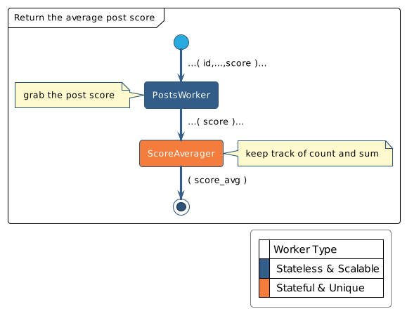
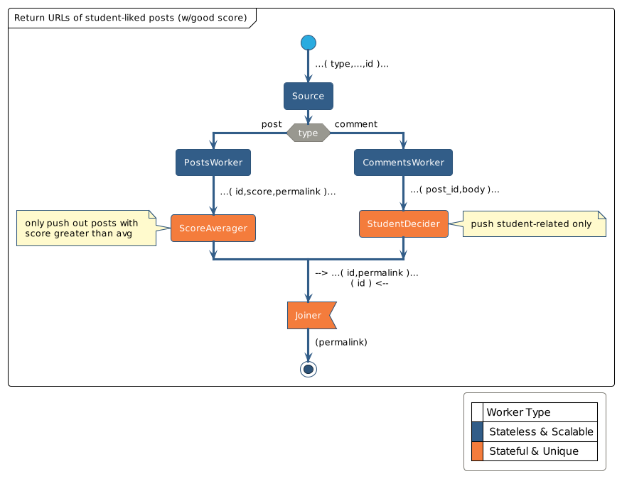
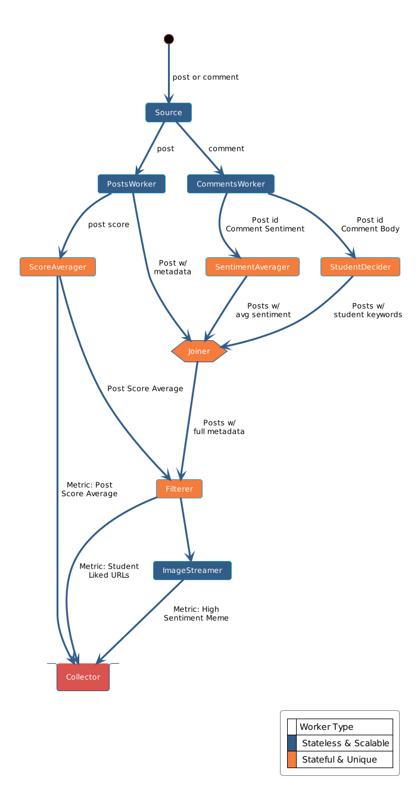

# Reddit Memes Analyzer -- [FdelMazo/7574-Distribuidos](https://github.com/FdelMazo/7574-Distribuidos)

## Introducción

El _Reddit Memes Analyzer_ es un sistema distribuido preparado para analizar datos que
provengan de Reddit. El resultado del análisis es en formato de **métricas**, las cuales
son provistas al cliente del sistema en formato JSON.

Para simular la entrada de datos (posts y comentarios) y poder controlar el resultado, 
la entrada del sistema es en forma de un archivo `.csv` fijo para los posts y otro para
los comentarios. Estos archivos son leídos y cada fila en ellos es envíada al sistema
por un `Feeder`.

Los datos son luego procesados por un conjunto de nodos conectados entre sí, en forma de
grafo acíclico. El grafo tiene un punto de entrada (el nodo `Source`) y un punto de
salida (el nodo `Collector`) donde se van depositando las métricas analizadas, y varios
nodos en el medio que son los encargados de filtrar, reducir, agregar, aplicar y operar
sobre los datos que van entrando al sistema.

En cualquier momento de la ejecución, un cliente (`Client`) puede conectarse y hablar 
con un servidor (`Server`), el cual provee las métricas recolectadas hasta el momento 
del pedido.

![]PAQUETES

A nivel práctico, la manera más sencilla de ver esta disposición es ver el archivo
`docker-compose-dev.yaml`, el cual contiene los nombres y perfiles de cada _container_
de nuestro sistema, donde cada perfil puede ser levantado por separado. Ahí podemos ver
que tenemos tres perfiles distintos:

- `graph`: El grafo acíclico que procesa los datos
- `feeder`: El ingreso de los datos
- `query`: La pregunta y respuesta de los datos

## Feeder

El `Feeder` simplemente se encarga de leer los archivos `.csv` y enviar los datos fila a
fila. Para simular un ambiente caotico, donde no sabemos que tipo de dato llega antes,
el `Feeder` lee tanto del archivo de posts como del de comentarios y le envía eso al
nodo `Source`. Esto se hace a un _endpoint_ único, en vez de a uno por cada tipo
distinto de dato para que luego el grafo en sí sea el encargado de discriminar y 
organizar lo que le llegó, sin pre-procesamiento previo.

![]ROBUSTNESS

## Cliente y servidor

Del otro lado del sistema, alejandonos de como entraron y fueron procesados los datos,
nos interesa saber como salirán. Lo que tenemos es, en una disposición de `REQ` y `REP`
bastante inocente, un cliente que cada unos segundos le preguntará a un servidor las
métricas que tiene hasta el momento. Es decir, nunca esperamos a asegurarnos de que los
archivos `.csv` fueron envíados en su totalidad, ya que en cualquier momento del
trayecto el sistema ya tiene datos que nos interesan (que más tarde serán pisados por
datos actualizados).

El servidor por lo tanto tiene dos funcionalidades:

- Escucha _requests_ del cliente, para saber cuando debe retornar métricas
- Recibe las métricas finales del grafo, para saber que envíar al cliente cuando se lo solicite
 
Es decir, en términos prácticos, el servidor también puede considerarse como parte del
grafo, ya que actua del nodo `Collector` (o `Sink`) de este. De todas maneras, estas dos
funcionalidades las vamos a tratar como separadas, ya que a nivel teórico son dos
componentes distintos del sistema.

![]ACTIVITY

## Funcionalidades

Las funcionalidades del sistema son sencillamente las métricas que soporta, con la idea
de que sea sencillo agregar métricas en un futuro. Con este objetivo en mente, en vez de
tener un _endpoint_ por cada métrica, simplemente tenemos un _endpoint_ único, dedicado
a traer todo lo que exista en el servidor.

Las métricas (actuales) son:

- El promedio de _score_ de todos los posts procesados
- La imagen más popular de acuerdo al sentimiento de los comentarios
- Las URLs de posts relacionados a contenido de estudiantes y universidades, basandonos
  en el contenido de sus comentarios.

Como podemos ver, se pueden dividir en dos tipos distintos de métricas: las que son
cadenas planas (el promedio y las URLs), y las que son contenido en bytes (la imagen).

Es por esto que hay que armar un (muy) pequeño protocolo de como el cliente recibe las
métricas, de manera tal que puedan ser genéricas y no haga falta agregar código
específico cada vez que agreguemos una métrica nueva.

```json
{
    [nombre] <string>: {
        'metric_value': [valor] <string>
        'metric_encoded': [indicador] <booleano opcional>
    }
}
```

La clave `'metric_encoded'` es opcional e indica que `'metric_value'` contiene una
cadena codificada en base 64. De suceder esto, el cliente recibe esa cadena, la
decodifica y la guarda en un archivo. En caso de la métrica sea una cadena plana, 
simplemente se imprime por pantalla.

![]CASOS DE USO

Las métricas son las que darán forma a nuestro grafo. Por separado, cada métrica tiene
su propia manera de ser procesada, pero lo que nos interesa es encontrar puntos en común
y lugares de optimización, para que el sistema pueda trabajar en conjunto en vez de ser
solamente N sistemas aislados que procesan métricas por su cuenta. 

### Promedio de score de posts

La métrica más sencilla de procesar es el promedio de _score_ de todos los posts
procesados. Consiste solamente de recibir un post, tomar su _score_ y promediarlo con el
resto. Buscando que cada nodo trabaje lo menos posible y pase al siguiente trabajo,
usamos a manera más liviana de contar un promedio: mantener una cantidad y una suma. Es
decir, con la cantidad de datos que estamos manejando, nos queremos ahorrar llamados 
como `sum(<list>)` que son más costosos.

{width=400}

Lo que podemos ver con este grafo de solo dos nodos es que tenemos dos tipos distintos 
de nodos: \textcolor{orange}{los que deben guardar estado} y \textcolor{teal}{los que no}. 

Los nodos que no deban llevar la cuenta de nada y sean _stateless_, son los que podrémos
escalar en nuestro sistema distribuido. Si yo me diese cuenta que tengo que procesar
5000 posts por cada 1 comentario que ingresa en mi sistema final, entonces dedicaría más
recursos a `PostsWorker` que al nodo que se encargue de trabajar en comentarios. Para
lograr esto tenemos que tener una disposición de la red que nos permita que las N
instancias de mi nodo escalable trabajen en paralelo, agarrando trabajos disponibles
desde la misma cola de tareas.

Por otro lado, los nodos que si tengan estado (llevar cuenta de un promedio, mantener en
memoria un conjunto de posts con algún atributo en particular, etc) son los que deben
ser únicos, y así ahorrarnos los problemas de sincronización, usando la
filosofía de
[ZeroMQ](https://zguide.zeromq.org/docs/chapter2/#Multithreading-with-ZeroMQ) de ``Share
Nothing''.


### Meme con mayor sentimiento de comentarios promedio

La segunda métrica a devolver es una imagen de un post, basado en metadata que proviene
de sus comentarios. Es acá donde nos cruzamos con nodos más complejos, en particular el
`Joiner`. Lo que precisamos es un nodo que pueda recibir información de distintos
lugares y unirla antes de seguir con el resto del grafo.

{width=500}

Al introducir el nodo `Joiner` y el nodo `Filterer`, empezamos a encontrarnos con
decisiones a tomar en cuanto a la disposición de los nodos. ¿Primero filtro, y luego uno,
o primero uno y luego filtro? Esta pregunta nos la podemos hacer porque al tener juntos 
todos los datos por los que tengo que filtrar, no me veo forzado a hacer ninguna
operación antes que la otra. Ya que podemos elegir, lo ideal sería que el `Joiner`, que
hasta ahora es el nodo que más almacena en memoria, reciba la menor cantidad de datos
posibles, por lo que tiene sentido que el `Filterer` venga antes.

### Posts que más gustan a estudiantes

La última métrica a devolver es bastante similar a la anterior, juntando datos tanto de
los posts como de los comentarios. Lo que incluímos acá es que tenemos dos filtros. Por
un lado, queremos filtrar los posts que incluyen contenido de estudiantes, y por el
otro, queremos filtrar los posts con score mayor al promedio.

{width=500}

En este caso, para no tener una lista larga de posts a devolver, en cada iteración que 
me pidan la métrica devolvemos un _sample_ al azar de N posts, en vez de la lista
entera.

## Grafo

Habiendo visto cada métrica por separado, es ahora que podemos diseñar un grafo que
contenga las tres funcionalidades trabajando en conjunto, ya que datos de una le sirven
a otra. 

La suma de estas métricas separadas no es trivial, ya que lo que en una es una ventaja,
en la siguiente puede ser una desventaja. Si bien se podrían tener un nodo por cada una
de todas las tareas que vimos hasta ahora, todo por separado, también queremos lograr
una unicidad semántica y funcional, para lograr que agregar métricas en el futuro no sea
extremadamente complejo. 

Las cosas que podemos notar de los diseños son:

- Necesitamos un colector/sumidero que este todo el tiempo disponible para entregarle
  una métrica (o, alternativamente, tener un sumidero por cada métrica).
- Podemos intentar unir nodos acorde a los datos que procesan (un trabajador de
  atributodse sentimiento) como a las operaciones que aplican (por ejemplo, un filtrador 
  genérico, sin importar si recibe posts o comentarios).
- El diseño original de las métricas por separado puede cambiar cuando unamos todo, ya
  que habrá _trade-offs_ involucrados en la estructura del grafo final.

{width=500}

Los nodos que armamos son:
-

![]robar push/pull de zmq
![]grafo despliegue


